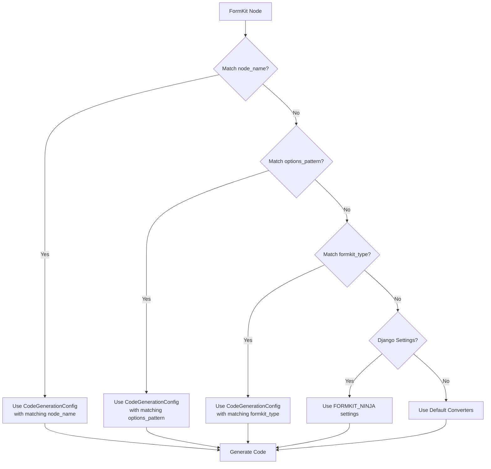
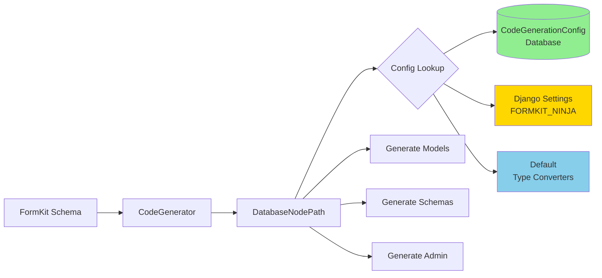

# Database-Driven Code Generation

**New in v0.8.1** - Configure code generation through the Django admin instead of writing Python code!

## Overview

FormKit-Ninja now supports **database-driven code generation configuration**, allowing you to override type mappings, field arguments, and other code generation rules through the Django admin interface or settings, without needing to create custom Python classes.

### Key Benefits

✅ **No Code Required** - Configure through Django admin  
✅ **Dynamic Updates** - Change configs without redeploying  
✅ **Priority System** - Fine-grained control over which rules apply  
✅ **Settings Fallback** - Support for Django settings configuration  
✅ **Backward Compatible** - Existing custom NodePath classes still work  

## Architecture

### Priority Cascade

Code generation configuration follows this priority cascade (highest to lowest):



### Component Diagram



---

## Lifecycle of a Node

How does a single field in your FormKit JSON become a line of code in `models.py`? 

### 1. The Source: `FormKitSchema`
A `FormKitSchema` record in your database contains a JSON array. For example:
```json
{ "$formkit": "text", "name": "district_name" }
```

### 2. The Bridge: `DatabaseNodePath`
The `CodeGenerator` walks through this JSON. For the "district_name" node, it creates a `DatabaseNodePath` instance. This instance is responsible for answering questions like *"What is your Django type?"*.

### 3. The Instruction: `CodeGenerationConfig` (The DB "Node")
The `DatabaseNodePath` queries the database for a `CodeGenerationConfig` that matches:
- `formkit_type="text"`
- `node_name="district_name"` (Highest priority)

If it finds an entry, it "loads" the instructions:
- **Django Type**: `ForeignKey`
- **Django Args**: `{"to": "pnds.District", "null": true}`

### 4. The Blueprint: Jinja2 Templates
The `CodeGenerator` passes the `DatabaseNodePath` to the `models.py.jinja2` template. The template contains code like this:

```jinja2
{{ nodepath.name }} = models.{{ nodepath.to_django_type }}({{ nodepath.to_django_args }})
```

### 5. The Output: Generated Python
The final result written to your disk is:
```python
district_name = models.ForeignKey("pnds.District", null=True)
```

By changing the `CodeGenerationConfig` **in the database**, you change the behavior of the `DatabaseNodePath`, which in turn changes the rendered output of the template without ever touching the generator's source code.

## Quick Start

### 1. Enable Database-Driven Generation

Database-driven generation is **enabled by default** in v0.8.1+. The `GeneratorConfig` automatically uses `DatabaseNodePath`:

```python
from formkit_ninja.parser.generator_config import GeneratorConfig

config = GeneratorConfig(
    app_name="myapp",
    output_dir=Path("./generated"),
    # DatabaseNodePath is now the default!
)
```

### 2. Create Configurations via Admin

Navigate to **Django Admin → Code generation configs → Add code generation config**

#### Example: Override a Specific Field

**Use Case**: Make the `district` field a ForeignKey instead of TextField

```
Matching Criteria:
- FormKit type: text
- Node name: district  ← Matches the field name
- Priority: 10

Type Overrides:
- Django type: ForeignKey

Field Configuration:
- Django args:
  {
    "to": "pnds_data.zDistrict",
    "on_delete": "models.CASCADE",
    "null": true
  }
```

#### Example: Override by Pattern

**Use Case**: All fields with IDA lookup options should be integers

```
Matching Criteria:
- FormKit type: select
- Options pattern: $ida(  ← Matches options starting with "$ida("
- Priority: 5

Type Overrides:
- Pydantic type: int
```

#### Example: Type-Level Override

**Use Case**: All datepicker fields should use DateField

```
Matching Criteria:
- FormKit type: datepicker
- Priority: 0

Type Overrides:
- Django type: DateField
```

## Configuration Reference

### CodeGenerationConfig Model

| Field | Type | Description | Example |
|-------|------|-------------|---------|
| `formkit_type` | CharField | FormKit type to match | `"text"`, `"select"`, `"datepicker"` |
| `node_name` | CharField | Specific field name (highest priority) | `"district"`, `"start_date"` |
| `options_pattern` | CharField | Pattern in options field | `"$ida("`, `"$enum("` |
| `pydantic_type` | CharField | Override Pydantic type | `"int"`, `"Decimal"`, `"date"` |
| `django_type` | CharField | Override Django field type | `"ForeignKey"`, `"IntegerField"` |
| `django_args` | JSONField | Django field arguments | `{"null": true, "max_length": 100}` |
| `extra_imports` | JSONField | Additional imports | `["from decimal import Decimal"]` |
| `validators` | JSONField | Field validators | `["MinValueValidator(0)"]` |
| `priority` | IntegerField | Matching priority (higher = first) | `0`, `10`, `100` |
| `is_active` | BooleanField | Enable/disable without deleting | `true`, `false` |

### Django Settings Configuration

You can also configure overrides in `settings.py`:

```python
FORMKIT_NINJA = {
    # Type-level mappings
    "TYPE_MAPPINGS": {
        "datepicker": {
            "django_type": "DateField",
            "pydantic_type": "date",
        },
        "currency": {
            "pydantic_type": "Decimal",
            "extra_imports": ["from decimal import Decimal"],
        },
    },
    
    # Field name mappings (higher priority than TYPE_MAPPINGS)
    "NAME_MAPPINGS": {
        "district": {
            "django_type": "ForeignKey",
            "django_args": {
                "to": "pnds_data.zDistrict",
                "on_delete": "models.CASCADE",
                "null": True,
            },
        },
    },
    
    # Options pattern mappings
    "OPTIONS_MAPPINGS": {
        "$ida(": {
            "pydantic_type": "int",
        },
    },
}
```

## Common Use Cases

### Use Case 1: Foreign Key Relationships

**Problem**: Need to reference another model instead of storing text

**Solution**: Create a node-specific config

```python
# Via Admin:
formkit_type = "text"
node_name = "health_zone"
django_type = "ForeignKey"
django_args = {
    "to": "pnds_data.zHealthZone",
    "on_delete": "models.PROTECT",
    "related_name": "submissions"
}
```

**Generated Code**:
```python
# models/myform.py
health_zone = models.ForeignKey(
    "pnds_data.zHealthZone",
    on_delete=models.PROTECT,
    related_name="submissions"
)
```

### Use Case 2: Decimal Fields for Currency

**Problem**: Currency values need decimal precision

**Solution**: Type-level config with custom imports

```python
# Via Admin:
formkit_type = "text"
node_name = "amount"
pydantic_type = "Decimal"
extra_imports = ["from decimal import Decimal"]
```

**Generated Code**:
```python
# schemas/myform.py
from decimal import Decimal

class MyFormSchema(BaseModel):
    amount: Decimal | None = None
```

### Use Case 3: Integer Enumerations

**Problem**: IDA lookups return integers, not strings

**Solution**: Pattern-based config

```python
# Via Admin:
formkit_type = "select"
options_pattern = "$ida("
pydantic_type = "int"
```

**Matches**:
- `<FormKit type="select" name="status" options="$ida(yesno)" />`
- `<FormKit type="select" name="category" options="$ida(categories)" />`

### Use Case 4: Custom Validators

**Problem**: Need to add validation constraints

**Solution**: Add validators in config

```python
# Via Admin:
formkit_type = "number"
node_name = "age"
validators = [
    "MinValueValidator(0)",
    "MaxValueValidator(150)"
]
extra_imports = [
    "from django.core.validators import MinValueValidator, MaxValueValidator"
]
```

## Priority System Deep Dive

### Understanding Priority Values

The `priority` field determines which config wins when multiple configs could match a node:

```python
# Priority 100: Most specific - this field only
CodeGenerationConfig(
    formkit_type="text",
    node_name="special_field",
    priority=100,
)

# Priority 50: Medium - pattern-based matching
CodeGenerationConfig(
    formkit_type="select",
    options_pattern="$ida(",
    priority=50,
)

# Priority 0: Lowest - type-level default
CodeGenerationConfig(
    formkit_type="text",
    priority=0,
)
```

### Matching Examples

**Example Node**:
```xml
<FormKit type="select" name="status" options="$ida(yesno)" />
```

**Potential Matches** (checked in order):

1. ✅ **Priority 100**: `formkit_type="select"` AND `node_name="status"` (most specific)
2. ✅ **Priority 50**: `formkit_type="select"` AND `options_pattern="$ida("` (pattern match)
3. ✅ **Priority 0**: `formkit_type="select"` (type-level)

The **highest priority** match wins!

### Inactive Configurations

Set `is_active=False` to temporarily disable a configuration without deleting it:

```python
# Disabled - will be skipped during generation
CodeGenerationConfig(
    formkit_type="text",
    node_name="legacy_field",
    is_active=False,  # ← Ignored
)
```

## Admin Interface Guide

### List View Features

The admin list view shows:

- **Summary**: Human-readable config description
- **FormKit Type**: The type being configured
- **Node Name**: Specific field name (if any)
- **Priority**: Matching priority
- **Active**: Whether config is enabled
- **Pydantic**: ✓ if Pydantic type is overridden
- **Django**: ✓ if Django type/args are overridden
- **Created**: When config was created

### Filtering

Filter by:
- Active status (active/inactive)
- FormKit type (text, select, etc.)
- Has node name (yes/no)
- Has options pattern (yes/no)
- Creation date

### Searching

Search across:
- FormKit type
- Node name
- Options pattern
- Pydantic type
- Django type

### Organizing Fieldsets

Fields are organized into logical groups:

1. **Matching Criteria** - Define what nodes this applies to
2. **Type Overrides** - Override Pydantic/Django types
3. **Field Configuration** - Django field arguments
4. **Advanced** (collapsed) - Extra imports and validators
5. **Metadata** (collapsed) - Creation/update timestamps

## Migration Guide

### From Custom NodePath Classes

**Before (Custom NodePath)**:

```python
from formkit_ninja.parser.type_convert import NodePath

class CustomNodePath(NodePath):
    def to_django_type(self) -> str:
        if hasattr(self.node, 'name') and self.node.name == 'district':
            return 'ForeignKey'
        return super().to_django_type()
    
    def to_django_args(self) -> str:
        if hasattr(self.node, 'name') and self.node.name == 'district':
            return 'to="pnds_data.zDistrict", on_delete=models.CASCADE'
        return super().to_django_args()

config = GeneratorConfig(
    app_name="myapp",
    output_dir=Path("./generated"),
    node_path_class=CustomNodePath,  # Custom class
)
```

**After (Database Config)**:

```python
# 1. Create config via Django admin (one-time):
CodeGenerationConfig.objects.create(
    formkit_type="text",
    node_name="district",
    django_type="ForeignKey",
    django_args={
        "to": "pnds_data.zDistrict",
        "on_delete": "models.CASCADE",
    },
)

# 2. Use default DatabaseNodePath (no custom code needed!):
config = GeneratorConfig(
    app_name="myapp",
    output_dir=Path("./generated"),
    # DatabaseNodePath is automatic!
)
```

### From Settings-Only Configuration

Settings still work! Database configs take priority over settings:

```python
# settings.py
FORMKIT_NINJA = {
    "TYPE_MAPPINGS": {
        "text": {"django_type": "TextField"},  # Default
    }
}

# Database config overrides settings:
CodeGenerationConfig.objects.create(
    formkit_type="text",
    node_name="description",
    django_type="CharField",  # ← Overrides settings for this field
    django_args={"max_length": 500},
)
```

## Troubleshooting

### Issue: Config Not Being Applied

**Check**:
1. ✓ Is `is_active=True`?
2. ✓ Does `formkit_type` match exactly? (case-sensitive)
3. ✓ For node_name matches, does the name match exactly?
4. ✓ Is there a higher-priority config overriding it?

**Debug**:
```python
from formkit_ninja.code_generation_config import CodeGenerationConfig

# Check what configs exist
configs = CodeGenerationConfig.objects.filter(
    is_active=True,
    formkit_type="text"
).order_by("-priority")

for cfg in configs:
    print(f"Priority {cfg.priority}: {cfg}")
```

### Issue: Generated Code Not Using Override

**Verify `DatabaseNodePath` is being used**:

```python
from formkit_ninja.parser.generator_config import GeneratorConfig
from formkit_ninja.parser.database_node_path import DatabaseNodePath

config = GeneratorConfig(app_name="test", output_dir=Path("./out"))
assert config.node_path_class == DatabaseNodePath  # Should be True
```

### Issue: JSON Validation Errors

**Valid JSON format**:

```json
{
  "null": true,
  "blank": true,
  "to": "app.Model",
  "on_delete": "models.CASCADE"
}
```

**Invalid** (common mistakes):
- ❌ Single quotes: `{'null': True}` (use double quotes)
- ❌ Python booleans: `{"null": True}` (use lowercase: `true`)
- ❌ Trailing commas: `{"null": true,}` (remove trailing comma)

## API Reference

### DatabaseNodePath

The `DatabaseNodePath` class implements the priority cascade:

```python
from formkit_ninja.parser.database_node_path import DatabaseNodePath
from formkit_ninja.formkit_schema import TextNode

# Create a node
node = TextNode(name="district")

# Create nodepath (automatically queries database)
nodepath = DatabaseNodePath(node)

# Get type information (uses database config if available)
pydantic_type = nodepath.to_pydantic_type()  # e.g., "str"
django_type = nodepath.to_django_type()       # e.g., "ForeignKey"
django_args = nodepath.to_django_args()       # e.g., "to=..."
validators = nodepath.get_validators()         # e.g., ["MinValueValidator(0)"]
imports = nodepath.get_extra_imports()         # e.g., ["from decimal import Decimal"]
```

### Configuration Caching

`DatabaseNodePath` caches configuration lookups for performance:

```python
# First lookup: queries database
nodepath1 = DatabaseNodePath(TextNode(name="field1"))
type1 = nodepath1.to_pydantic_type()  # DB query

# Subsequent lookups: uses cache
type2 = nodepath1.to_pydantic_type()  # Cached!

# Different node: new query
nodepath2 = DatabaseNodePath(TextNode(name="field2"))
type3 = nodepath2.to_pydantic_type()  # DB query
```

Cache is per-instance and includes `formkit_type`, `node_name`, and `options`.

## Best Practices

### 1. Use Specific Priorities

```python
# ✅ Good: Clear priority levels
- Field-specific overrides: priority=100
- Pattern-based rules: priority=50
- Type-level defaults: priority=0

# ❌ Avoid: All same priority
- Multiple configs with priority=0 (unpredictable which wins)
```

### 2. Document Complex Configurations

Use clear, descriptive summaries in the admin that explain WHY a config exists:

```
Summary: District field → FK to zDistrict table (PNDS data)
```

### 3. Test Configuration Changes

After updating configs, regenerate a test schema to verify:

```bash
python manage.py generate_code --schema-id=123 --output=/tmp/test
# Check /tmp/test/models/*.py to verify changes
```

### 4. Version Control Fixtures

Export configs for version control:

```bash
python manage.py dumpdata formkit_ninja.CodeGenerationConfig \
  --indent=2 > fixtures/code_gen_configs.json
```

Load on other environments:

```bash
python manage.py loaddata fixtures/code_gen_configs.json
```

### 5. Start with Settings, Graduate to Database

For project-wide defaults, use settings. For specific overrides or frequently changing rules, use database configs:

```python
# settings.py - Project defaults
FORMKIT_NINJA = {
    "TYPE_MAPPINGS": {
        "datepicker": {"django_type": "DateField"},
    }
}

# Database - Specific overrides that may change
CodeGenerationConfig.objects.create(
    formkit_type="datepicker",
    node_name="end_date",
    django_args={"null": True},  # This field is optional
)
```

## See Also

- [Code Generation Guide](code_generation.md) - General code generation documentation
- [Options Documentation](options.md) - FormKit options patterns
- [Admin Guide](admin.md) - Django admin interfaces
