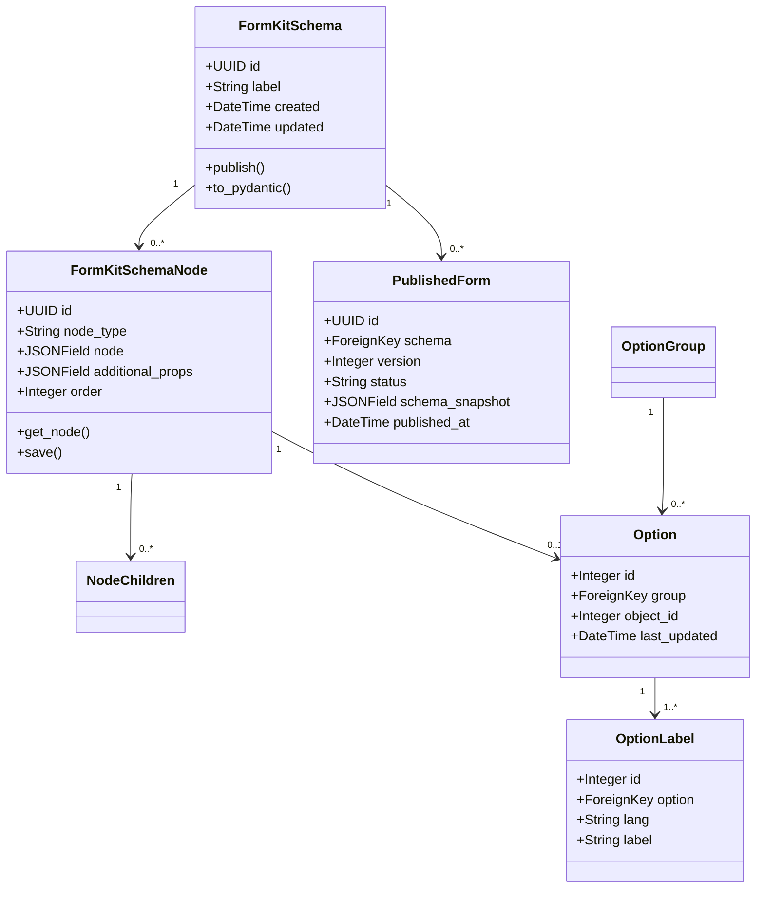

# Architecture

Understanding how FormKit Ninja integrates Django and FormKit schemas.

---

## System Overview

FormKit Ninja acts as a bridge between Django's backend capabilities and FormKit's schema-based forms, enabling you to:

- **Store** FormKit schemas in a relational database
- **Manage** schemas through Django admin
- **Serve** schemas via REST API
- **Version** schemas for data consistency


---

## Core Components

### 1. Django Models

The foundation of FormKit Ninja is a set of Django models that represent FormKit schemas:



---

### 2. Data Flow

#### Creating a Form


#### Serving a Form


---

### 3. Storage Strategy

FormKit Ninja uses a **hybrid storage approach**:

#### Node Data (`JSONField`)

The `node` field stores the FormKit node definition as JSON:

```json
{
  "$formkit": "text",
  "name": "email",
  "label": "Email Address",
  "validation": "required|email",
  "placeholder": "user@example.com"
}
```

#### Additional Props (`JSONField`)

Custom metadata not part of FormKit spec:

```json
{
  "help_text": "We'll never share your email",
  "tracking_id": 12345,
  "custom_validation_message": "Please use a valid email"
}
```

#### Normalized Fields

Key fields are extracted for efficient querying:

- `node_type` - For filtering ("$formkit", "$el", etc.)
- `order` - For sorting nodes
- `schema` - Foreign key for relationships

---

### 4. PostgreSQL Triggers

FormKit Ninja uses `django-pgtrigger` for data integrity:


**Key Triggers:**

- `assign_order_on_insert` - Auto-assign order to new nodes
- `track_node_changes` - Track modification timestamps
- `protect_node_deletes_and_updates` - Prevent changes to published nodes

---

### 5. API Layer

Django-Ninja provides the REST API:

```python
from ninja import Router
from formkit_ninja.models import FormKitSchema

router = Router()

@router.get("/schema/{schema_id}")
def get_schema(request, schema_id: str):
    schema = FormKitSchema.objects.get(id=schema_id)
    return {
        "id": schema.id,
        "label": schema.label,
        "nodes": [node.to_dict() for node in schema.ordered_nodes()]
    }
```

**Features:**
- Automatic OpenAPI docs
- Type validation with Pydantic
- Fast JSON serialization
- Easy testing

---

## Design Decisions

### Why PostgreSQL?

- **JSON Support**: Native JSONB fields for schema storage
- **Triggers**: Complex business logic at database level
- **Performance**: Efficient querying and indexing
- **Reliability**: ACID compliance for data integrity

### Why Django-Ninja?

- **Modern**: FastAPI-style syntax
- **Type-Safe**: Pydantic integration
- **Fast**: Better performance than DRF
- **OpenAPI**: Automatic API documentation

### Why Store Schemas in DB?

**Instead of static JSON files:**

✅ **Dynamic Updates**: Change forms without deployments  
✅ **Versioning**: Track history and rollback  
✅ **Admin UI**: Non-developers can manage forms  
✅ **Querying**: Find forms by criteria  
✅ **Relationships**: Link submissions to form versions  

---

## Scaling Considerations

### For Read-Heavy Workloads


**Recommendations:**
- Cache published forms (they're immutable!)
- Use Redis for frequently accessed schemas
- CDN for static schema snapshots
- Database read replicas

### For Write-Heavy Workloads

- Use async task queues (Celery) for batch operations
- Bulk create nodes instead of individual inserts
- Disable triggers temporarily for large imports
- Use database connection pooling

---

## Security

### Admin Access

```python
# Restrict admin to staff
@admin.register(FormKitSchema)
class FormKitSchemaAdmin(admin.ModelAdmin):
    def has_add_permission(self, request):
        return request.user.is_staff
```

### API Authentication

```python
from ninja.security import HttpBearer

class AuthBearer(HttpBearer):
    def authenticate(self, request, token):
        # Validate token
        return user_from_token(token)

@api.get("/schemas", auth=AuthBearer())
def list_schemas(request):
    return FormKitSchema.objects.filter(owner=request.auth)
```

### Data Validation

- Pydantic models validate schema structure
- Django model validation for business rules
- Database constraints for referential integrity

---

## Extension Points

### Custom Node Types

```python
# Custom validation for your node types
def validate_custom_node(node_data):
    if node_data.get('type') == 'custom_widget':
        # Your validation logic
        pass
```

### Custom API Endpoints

```python
@api.get("/schemas/by-category/{category}")
def schemas_by_category(request, category: str):
    return FormKitSchema.objects.filter(
        additional_props__category=category
    )
```

### Custom Admin Actions

```python
@admin.action(description="Duplicate selected schemas")
def duplicate_schemas(modeladmin, request, queryset):
    for schema in queryset:
        schema.pk = None
        schema.label = f"{schema.label} (Copy)"
        schema.save()
```

---

## See Also

- [Models Reference](../reference/models.md) - Detailed model documentation
- [API Endpoints](../reference/api-endpoints.md) - Complete API reference
- [Options System](options-system.md) - How multilingual options work

**Next**: [Options System →](options-system.md)

