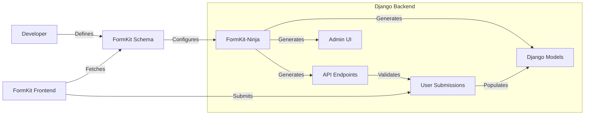

# FormKit-Ninja Documentation

Welcome to the formkit-ninja documentation!

**FormKit-Ninja** bridges the gap between [FormKit](https://formkit.com) frontend schemas and [Django](https://www.djangoproject.com/) backends. It provides a complete "Form-as-Code" workflow where your form definitions drive your database schema, API validation, and admin interfaces.

### System Context

### Why FormKit-Ninja?

- **Single Source of Truth**: Your FormKit schema defines both your frontend UI and your backend storage.
- **Type Safety**: Automatic generation of Pydantic schemas ensures API payloads match your forms.
- **Rapid Development**: Skip writing boilerplate models, serializers, and admin classes.
- **Data Integrity**: Submissions are captured as raw JSON first, then normalized into structured tables.

## What's New

⭐ **v0.8.1** - [Database-Driven Code Generation](database_code_generation.md)! Configure type mappings and field overrides through Django admin without writing Python code.

## Project layout

    mkdocs.yml    # The configuration file.
    docs/
        index.md                        # The documentation homepage.
        database_code_generation.md     # Database-driven code generation (NEW!)
        code_generation.md              # Code generation guide
        feature_matrix.md               # Supported features comparison.
        inputs.md                       # Guide to using inputs.
        classes.md                      # Class reference.
        options.md                      # Options documentation.
        admin.md                        # Admin documentation.

## User Guides

*   **[Database-Driven Code Generation](database_code_generation.md)** ⭐ NEW - Configure code generation through Django admin
*   [Code Generation Guide](code_generation.md): Comprehensive code generation documentation
*   [Feature Matrix](feature_matrix.md): See what FormKit features are supported.
*   [Inputs Guide](inputs.md): Learn how to use standard and pro inputs.
*   [Class Reference](classes.md): Technical documentation for key classes.
*   [Options Documentation](options.md): FormKit options patterns
*   [Admin Guide](admin.md): Django admin interfaces
