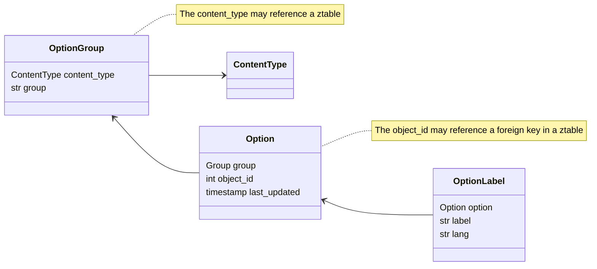

# Options

## Goals

- Provide consistency with current `ztable` option Ids
- Allow the correction of spelling mistakes from `ztable` options
- Incremental updates to the client (idb, based on timestamp)
- Allow addition of new ids, which effectively *extend* ztables while keeping them read-only
- Give the frontend a **consistent** set of options for everything

## Models Overview



## Importing

The management command `setup_options` should update the groups.

Here's a cut down version of that command

```python
# These are models which we handle through other methods or obsolete
skip_models = {
    pnds_data.zAldeia,
    ...
}


def backfill_from_translate():
    """
    Fill in missing 'options' from the 'translations' table
    """

    sql = """
        insert into ida_optionlabel (label, lang, option_id)
        ...
    """

    with connection.cursor() as c:
        ...
        c.execute(sql)


def import_one_option(group: OptionGroup, instance, label_field: str, lang: str):

    # ... creates an`OptionLabel(s)` for given language, creating an `Option` first if required

 
    Option.objects.get_or_create(
        ...
    )
    label = getattr(instance, label_field, None)
    OptionLabel.objects.get_or_create(
        option=i,
        lang=lang,
        defaults=dict(label=label),
    )


def get_label_field(model_class: type, lang: str) -> str:
    # Matches the model and lang string passed to determine what to use
    # as the 'label' field in the import
    label_field: str | None = None
    match model_class, lang:
        case pnds_data.zCMTPositions, "en":
            label_field = "cmtposition"
        ... 
    return label_field


class Command(BaseCommand):
    help = "Move (migrate) pnds zTables to ida 'Options'."

    def handle(self, *args, **options):
        # For each `ztable`, import all the options
        # then sync translations from the `translatable` table where missing

        for lang in ("en", "tet"):
            # Note that there are no existing 'pt' language options
            for ztable in ztables:
                ...
                for instance in objects:
                    import_one_option(group, instance, label_field, lang)

        backfill_from_translate()
```

## Client Side

On the client side these options are stored in IDB and incrementally updated. This is based on the `last_updated` sent as a header

- On visiting the `Hatama Dadus` or data entry page I see a call to `http://localhost:3000/api/ida/options`
  - This populates an object store in `pnds_data.options`
- On next visit I see a call to `http://localhost:3000/api/ida/options?since=2023-08-24T00%3A10%3A02.569107%2B00%3A00`
  - This updates any changes since then
  -

### Clearing the Options

Note that if you delete options from the server, the client will still have the "old" options. This can lead to duplicates. It's not anticipated that this would happen in production. (We should have a 'disabled' field on option perhaps?)

To test recreating the `options`

- Delete all options from the object store `options` in idb `pnds_data`
- Delete the key `/api/ida/options.last_updated` from the idb_keyval store

## The API

The API returns a list formatted such as:

```json
[{
    "id": 962,
    "object_id": 2,
    "group_name": "zactivities",
    "optionlabel_set": [
        {
            "lang": "en",
            "label": "Rehabilitation"
        },
        {
            "lang": "tet",
            "label": "Rehabilitasaun"
        },
        {
            "lang": "pt",
            "label": "Reabilitação"
        }
    ]
}
]
```

- This is from the group name `zactivities`. That group is derived from the `zActivities` table.
- The object id is 2 (in this case it's the original ID from pnds).
- There are 3 translation labels attached to this (some might only have 1 or 2).

## CRUD Ops

### Delete

Deletion is **not yet** supported

### Add

To extend an existing 'ztable':

- Find the group

```
In [1]: OptionGroup.objects.first()
Out[1]: <OptionGroup: OptionGroup object (zactivities)>
```

- Find the max object id (aggregation can help)

```
 In [3]: OptionGroup.objects.filter(group='zactivities').aggregate(Max('option__object_id'))
Out[3]: {'option__object_id__max': 7}
```

- Create a new "Option" in the group

```
In [4]: Option.objects.create(group_id='zactivities', object_id=8)
Out[4]: <Option: Option object (1441)>
```

- Create a new "OptionLabel"

```
In [5]: OptionLabel.objects.create(lang='en', label='My Option', option_id=1441)
Out[5]: <OptionLabel: OptionLabel object (3760)>
```

- Visit 'Hatama Dadus' page
- See that in requests you have a new Option

```json
{
 "0": {
  "id": 1441,
  "object_id": 8,
  "group_name": "zactivities",
  "optionlabel_set": [
   {
    "lang": "en",
    "label": "My Option"
   }
  ]
 }
}
```

## Updates (Spelling Correction)

through the django admin you can update labels inline on Option

For example above:
<http://localhost:8000/admin/ida/option/1441/change/>

I can update the translations and then I will get the updated options.

The GET request will be

```json
[
 {
  "id": 1441,
  "object_id": 8,
  "group_name": "zactivities",
  "optionlabel_set": [
   {
    "lang": "en",
    "label": "My Option Updated"
   },
   {
    "lang": "tet",
    "label": "Hau nia Opsaun"
   },
   {
    "lang": "pt",
    "label": "? I don't know how to translate this!"
   }
  ]
 }
]
```
