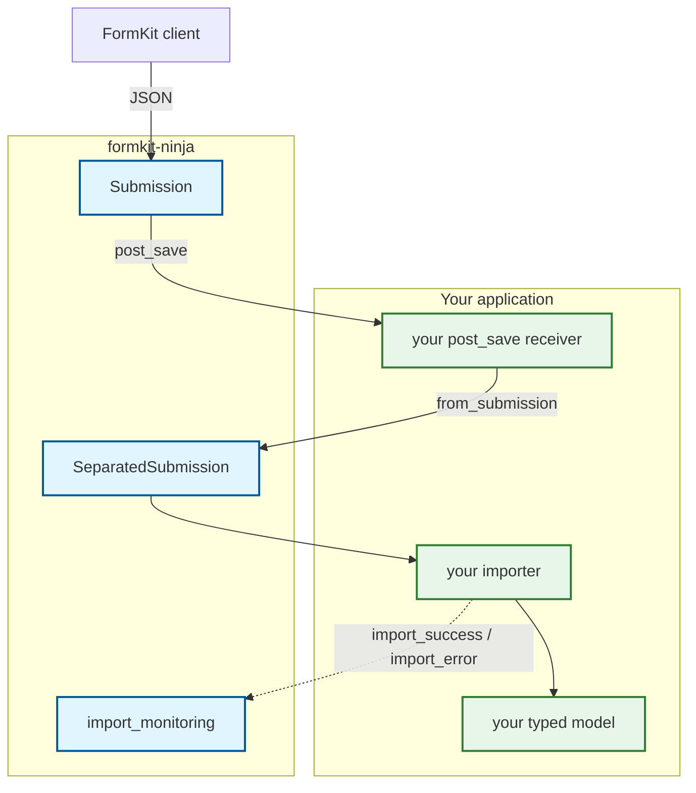

# Submission Architecture

How a submitted document becomes rows, and where an application hooks into that.

## Concept

`formkit-ninja` separates **storing** a submission from **deriving** anything out of it.
A `Submission` row is the canonical document: it is saved first, saved whole, and saved
even if everything downstream fails. Deriving `SeparatedSubmission` rows from it, and
populating an application's own typed tables from those, happen afterwards and are the
application's call.

This is what makes the split safe to re-run, and what lets an application decide *when*
it happens — inline, in a task queue, or in a management command.



Everything inside the library box is provided. Everything in the application box is
yours to write — including the arrow that starts the split.

---

## Wiring the split

`Submission.save()` does **not** derive `SeparatedSubmission` rows. Nothing derives them
until you connect a receiver:

```python
# yourapp/signals.py
from django.db.models.signals import post_save
from django.dispatch import receiver

from formkit_ninja.form_submission.models import SeparatedSubmission, Submission


@receiver(post_save, sender=Submission)
def split_submission(sender, instance, **kwargs):
    SeparatedSubmission.objects.from_submission(instance)
```

Connect it from your `AppConfig.ready()` — importing the module is enough — so it is live
for every save path: API, admin, shell and management commands.

**Why the library does not do this itself.** It used to, from inside `save()` and *after*
`post_save` had already fired. An application running its own split from a `post_save`
receiver — the arrangement documented here — therefore split every submission twice, and
any work it did after its own split could be undone by the library's second pass. See
issue #57.

Two consequences worth knowing:

- **Nothing splits until you wire it.** A submission saved with no receiver connected is
  stored correctly but has no derived rows, and the derived-model endpoints will show
  nothing for it. There is no error and no warning; the tables are simply empty.
- **Orphan reconciliation rides on the split.** `from_submission()` sweeps rows that no
  longer exist in the canonical fields, so that self-healing only runs as often as your
  receiver does. The `reconcile_separated_submissions` management command is the
  out-of-band sweep.

---

## Recording import outcomes

The library declares two signals and records what they carry. It does not send them —
**your importer does**, because only your code knows whether populating your model
succeeded.

| Signal | You send it when | Arguments |
|---|---|---|
| `import_success` | Your importer populated a typed model from a `SeparatedSubmission`. | `sender`, `instance`, `model_instance`, `was_created` |
| `import_error` | Your importer raised while doing so. | `sender`, `instance`, `error` |

They live in `formkit_ninja.form_submission.signals`. `import_monitoring` receives both
and writes a `SeparatedSubmissionImport` row, which is what
`SeparatedSubmission.objects.with_import_failure()` and the admin's import-status columns
read.

```python
# yourapp/importer.py
from formkit_ninja.form_submission import signals as formkit_signals


def import_row(separated_submission):
    try:
        model_instance, was_created = populate_my_model(separated_submission)
    except Exception as exc:
        formkit_signals.import_error.send(
            sender=separated_submission.__class__,
            instance=separated_submission,
            error=exc,
        )
        raise
    formkit_signals.import_success.send(
        sender=separated_submission.__class__,
        instance=separated_submission,
        model_instance=model_instance,
        was_created=was_created,
    )
```

Sending them is optional. Skip it and the split still works; you just lose the
import-status surface.

---

## Populating your own models

The library has no hydration method. It deliberately does not know the shape of your
tables, so mapping a `SeparatedSubmission` onto your model is code you write — typically
in the receiver that reacts to the row being created, calling your importer as above.

The generated code from `generate_code` gives your models a `submission` one-to-one link
back to `SeparatedSubmission`, which is the anchor to populate against:

```python
submission = models.OneToOneField(
    "formkit_ninja.SeparatedSubmission",
    on_delete=models.CASCADE,
    primary_key=True,
    related_name="+",
)
```

Keying on that link is what keeps your typed table and the generic table in step: one row
each, sharing a primary key, so re-running the split updates rather than duplicates.

---

## Decomposition, in three stages

### Stage 1 — Flatten

The JSON document is walked recursively. Every group and repeating section is given a
stable UUID if it does not already carry one.

- **In**: the nested document.
- **Out**: a flat sequence of rows, each knowing its path, its identity, its answers and
  its position.

### Stage 2 — Normalise

Those rows are written as `SeparatedSubmission` records: one root row where
`repeater_key` is null, and one row per repeat, each pointing at its parent through
`repeater_parent`.

Identity comes from the document, never minted here — which is what lets the same
document replay to the same primary keys years later.

### Stage 3 — Populate

Your importer turns each row into a row of your own, as above.

The same decomposition is also available as frozen values that touch no database, through
`emit_submission`, for appending to a durable log. `from_submission` walks the same
emissions, so there is one decomposition rather than two that could drift.

---

## Re-processing by hand

```python
from formkit_ninja.form_submission.models import SeparatedSubmission, Submission


def reprocess_all():
    for submission in Submission.objects.all():
        rows = SeparatedSubmission.objects.from_submission(submission, force=True)
        print(f"{submission.pk}: {len(rows)} rows")
```

`from_submission` is idempotent on identity — re-running it updates the same rows rather
than creating new ones — and sweeps rows the document no longer contains.

**`force=True` is what makes re-processing do anything.** By default the split is
change-aware: a derived row whose computed values are identical to what is already stored
is not re-saved, so no `post_save` fires for it and no downstream work runs. That is the
behaviour you want on an ordinary save, and exactly the wrong one here — re-processing an
unchanged document without `force` walks every submission and fires nothing. Pass it when
you are rebuilding, and leave it off in the receiver that reacts to a live edit.

---

## See also

- [What is public](public-api.md) — which of these names you may rely on, and at what tier.
- `okf/concepts/submission-decomposition.md` — the same ground, written for agents.
